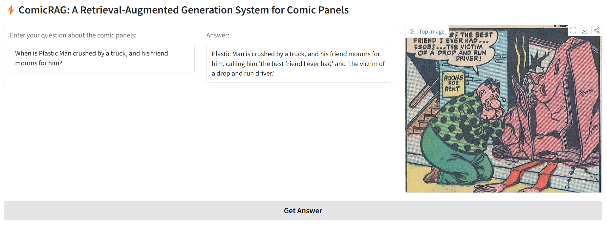

# 📖 ComicRAG 

In this project, I implement a RAG workflow based on a vector database of comic book panels with a Gradio UI.

## Dataset
I am implementing a RAG pipeline on an open source dataset of western, Golden Age comic books available here: https://obj.umiacs.umd.edu/comics/index.html

## ✅ Current Approach
### 1. Panel Captioning
I am using GPT-4o to caption one panel at a time, aiming to capture the scene as well as the dialogue/text and the character descriptions.
### 2. Creating the Vector Database
I am using the E5 small text embedding model to embed these captions and store them in a vector database via Chroma.
### 3. Candidate Reranking
I am using the bge-reranker-v2-m3 model to perform query-aware candidate reranking based on the text captions.
### 4. Final Answering with LLM
I am using GPT-4o to examine the top candidates based on the user's query and provide a final answer.

## 🏃‍♂️‍➡️ Current Usage
### Run the 'Run RAG App' debug configuration in the launch.json
Currently requires a valid open_ai_api_key.rtf file at the project root. 

## 🎯 Long Range Goal 
### 1. Use locally-hosted LLM for panel captioning and answer generation
Due to severe hardware constraints, Gemma 4 E2B and Qwen2.5-VL-3B are the current candidate models for these tasks. A challenge is that neither of these models seem sufficient at captioning panels well enough off-the-shelf; therefore, I am hand-captioning a set of panels to create a high-quality set of examples and will shortly have LoRA finetuning capabilities. Local training is possible, but may rent a superior GPU for a day to expedite the process.

## 📋 To Do
### 1. Query LLM further and store a set of character descriptions so that the captions can reference specific character names
Often names of characters are not mentioned in a given panel, so it would be useful to incorporate a multimodal Named Entity Recognition (NER) functionality to this project.
### 2. Manually create a test set for RAG
At this point, my tests for retrieval have been on a few-handpicked examples to verify functionality. To truly measure the performance of the full pipeline, from retrieval to generating the final comic and panel reference, I need to make a larger test set with Ground Truth for evaluation.
### 3. Add metadata tags to categorize the main action of the panel
I aim to query my LLM to categorize each panel during captioning as, for example, "dialogue", "action", "reveal", etc, so that retrieval can be accelerated and ideally made more accurate. Once implemented, when the user submits a query, the LLM can classify whether the panel being asked for likely falls into which categories, and then during retrieval, only vectors with those matching metadata fields will be searched.

## Challenges
### 1. Comic books are multimodal, featuring information in both text and imagery.
### 2. I have found that off-the-shelf vision embedding models (such as OpenCLIP) are not effective on the types of imagery typical in western comics.
### 3. Comic narratives leave complex transitions in time, place, and action between panels for the readers' imagination.

